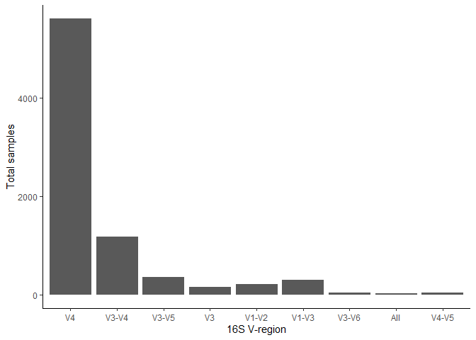
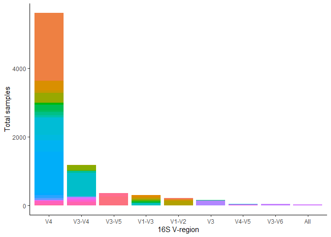
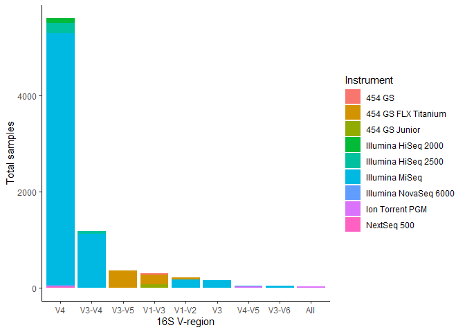
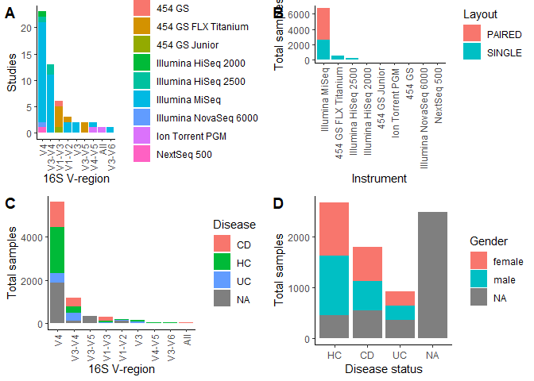

Inital overview of samples
================

-   [Load packages](#load-packages)
-   [Preperation of the American Gut Project
    (PRJEB11419)](#preperation-of-the-american-gut-project-prjeb11419)
-   [Overview of IBD studies with
    16S-seq](#overview-of-ibd-studies-with-16s-seq)
    -   [V4 region](#v4-region)
    -   [V3-V4 region](#v3-v4-region)
    -   [V1-V3 region](#v1-v3-region)
    -   [V1-V2 region](#v1-v2-region)
    -   [V4-V5 region](#v4-v5-region)
    -   [V3-V5 region](#v3-v5-region)
    -   [V3 region](#v3-region)
    -   [V3-V6 region](#v3-v6-region)
    -   [V3-V4, V6-V9 region](#v3-v4-v6-v9-region)
-   [Plot of available data](#plot-of-available-data)

## Load packages

``` r
library(dplyr)
library(tidyverse)
```

    ## Error: package or namespace load failed for 'tidyverse' in loadNamespace(j <- i[[1L]], c(lib.loc, .libPaths()), versionCheck = vI[[j]]):
    ##  navnerum 'cli' 3.2.0 er indlæst, men >= 3.3.0 er krævet

``` r
library(ggplot2)
library(ggpubr)

path <- "C:/Users/FX76TZ/OneDrive - Aalborg Universitet/Mikrobiom korrelation/"

packageVersion("dplyr")
```

    ## [1] '1.0.8'

``` r
packageVersion("tidyverse")
```

    ## [1] '1.3.1'

``` r
packageVersion("ggplot2")
```

    ## [1] '3.3.5'

``` r
packageVersion("ggpubr")
```

    ## [1] '0.4.0'

## Preperation of the American Gut Project (PRJEB11419)

``` r
df <- read.csv(paste0(path, "Metadata/test.txt"))
table(df$sample_type)
```

    ## 
    ##                         control blank            Ear wax              feces 
    ##               4029               2882                 56                  6 
    ##       food product           Forehead               Hair    LabControl test 
    ##                 10                654                 24                  1 
    ##          Left Hand           Left leg              Mouth              Mucus 
    ##                344                 51               2097                 36 
    ##              Nares        nasal mucus         Right Hand          Right leg 
    ##                 75                193                355                  6 
    ##               Skin              stool              Stool              Tears 
    ##                 59                  1              24589                 54 
    ##              Torso unspecified sample      Vaginal mucus 
    ##                123                  1                 65

``` r
df <- df %>% filter(sample_type %in% c("stool", "Stool", "feces"))

table(df$ibd_diagnosis_refined)
```

    ## 
    ##                                             Colonic Crohn's Disease 
    ##                               451                               295 
    ## Ileal and Colonic Crohn's Disease             Ileal Crohn's Disease 
    ##                                24                                62 
    ##                      Microcolitis                     not collected 
    ##                                21                                 3 
    ##                      not provided                      Not provided 
    ##                                17                             16965 
    ##                Ulcerative colitis                       Unspecified 
    ##                               167                              6591

``` r
hc <- df %>% filter(ibd == "I do not have this condition") %>% filter(liver_disease == "I do not have this condition") %>% filter(ibs == "I do not have this condition") %>% filter(migraine == "I do not have this condition") %>% filter(appendix_removed %in% c("false", "No")) %>% filter(asd == "I do not have this condition") %>% filter(autoimmune == "I do not have this condition")%>% filter(tonsils_removed %in% c("false", "No"))%>% filter(diabetes == "I do not have this condition") %>% filter(antibiotic_history == "I have not taken antibiotics in the past year.") %>% filter(!(cancer_treatment %in% c("Chemotherapy", "Radiation therapy", "Surgery only"))) %>% filter(skin_condition == "I do not have this condition") %>% filter(thyroid == "I do not have this condition")%>% filter(add_adhd == "I do not have this condition")%>% filter(asd == "I do not have this condition") %>% filter(fungal_overgrowth == "I do not have this condition") %>% filter(gluten != "I was diagnosed with celiac disease") %>% filter(gluten != "I was diagnosed with gluten allergy (anti-gluten IgG), but not celiac disease")%>% filter(clinical_condition == "I do not have this condition") %>% filter(!(pregnant %in% c("Yes", "true")))

cd <- df %>% filter(ibd_diagnosis_refined %in% c("Colonic Crohn's Disease", "Ileal and Colonic Crohn's Disease", "Ileal Crohn's Disease"))
uc <- df %>% filter(ibd_diagnosis_refined == "Ulcerative colitis")

#Remove duplicated individuals
cd <- cd[!duplicated(cd$Submitter_Id), ]
uc <- uc[!duplicated(uc$Submitter_Id), ]
hc <- hc[!duplicated(hc$Submitter_Id), ]

uc$Disease <- "UC"
cd$Disease <- "CD"
hc$Disease <- "HC"
uc$region <- "V4"
uc$chem <- "NA"
uc$sex <- "NA"
uc$BMI <- as.numeric(uc$weight_kg)/(as.numeric(uc$height_cm)/100)^2
```

    ## Warning: NAs introduced by coercion

    ## Warning: NAs introduced by coercion

``` r
cd$region <- "V4"
cd$chem <- "NA"
cd$sex <- "NA"
cd$BMI <- as.numeric(cd$weight_kg)/(as.numeric(cd$height_cm)/100)^2
```

    ## Warning: NAs introduced by coercion

``` r
hc$region <- "V4"
hc$chem <- "NA"
hc$sex <- "NA"
hc$BMI <- as.numeric(hc$weight_kg)/(as.numeric(hc$height_cm)/100)^2
```

    ## Warning: NAs introduced by coercion

    ## Warning: NAs introduced by coercion

``` r
uc <- uc %>% select(Run, AvgSpotLen, Bases,BioProject, BioSample, Bytes, Center.Name, ENA.LAST.UPDATE..run., Experiment, Disease, geo_loc_name_country, geo_loc_name_country_continent, geo_loc_name, Instrument, Library.Name, LibraryLayout, Platform, Sample.Name, SRA.Study, region, chem, Age_years, BMI, sex, smoking_frequency)
cd <- cd %>% select(Run, AvgSpotLen, Bases,BioProject, BioSample, Bytes, Center.Name, ENA.LAST.UPDATE..run., Experiment, Disease, geo_loc_name_country, geo_loc_name_country_continent, geo_loc_name, Instrument, Library.Name, LibraryLayout, Platform, Sample.Name, SRA.Study, region, chem, Age_years, BMI, sex, smoking_frequency)
hc <- hc %>% select(Run, AvgSpotLen, Bases,BioProject, BioSample, Bytes, Center.Name, ENA.LAST.UPDATE..run., Experiment, Disease, geo_loc_name_country, geo_loc_name_country_continent, geo_loc_name, Instrument, Library.Name, LibraryLayout, Platform, Sample.Name, SRA.Study, region, chem, Age_years, BMI, sex, smoking_frequency)

df <- rbind(uc, cd, hc)
write.csv(df, file = paste0(path, "/Metadata/american_df.txt"), quote = FALSE, row.names = FALSE)
```

## Overview of IBD studies with 16S-seq

``` r
df <- read.csv(paste0(path, "Metadata/Metadata_IBD_project.csv"), sep = ";")
american <- read.csv(file = paste0(path, "/Metadata/american_df_updated.txt"), sep="\t")
american <- american %>% dplyr::select(-chem)
colnames(american) <- colnames(df)
df_total <- rbind(df, american)
df_total[df_total==""]<-NA

df_total <- df_total %>% transform(AvgSpotLen = as.numeric(AvgSpotLen), Bases = as.numeric(Bases), Bytes = as.numeric(Bytes), Host_Age = as.numeric(Host_Age), host_body_mass_index = as.numeric(host_body_mass_index))
```

    ## Warning in eval(substitute(list(...)), `_data`, parent.frame()): NAs introduced
    ## by coercion

    ## Warning in eval(substitute(list(...)), `_data`, parent.frame()): NAs introduced
    ## by coercion

    ## Warning in eval(substitute(list(...)), `_data`, parent.frame()): NAs introduced
    ## by coercion

    ## Warning in eval(substitute(list(...)), `_data`, parent.frame()): NAs introduced
    ## by coercion

``` r
df <- df_total

table(df$Disease, useNA = "always")
```

    ## 
    ##   CD   HC   UC <NA> 
    ## 1797 2671  926 2485

``` r
length(unique(df$SRA.Study))
```

    ## [1] 50

``` r
table(df$host_sex, useNA = "always")
```

    ## 
    ##  female    male missing    <NA> 
    ##    2013    2040       2    3824

``` r
table(df$smoking_status, useNA = "always")
```

    ## 
    ##                        active                         Daily 
    ##                             3                            26 
    ##                        former                         Never 
    ##                             6                          1833 
    ##                            no                    non-smoker 
    ##                            21                           116 
    ##                  Not provided Occasionally (1-2 times/week) 
    ##                             3                            13 
    ##    Rarely (a few times/month)    Regularly (3-5 times/week) 
    ##                            66                            17 
    ##                        smoker                   Unspecified 
    ##                            29                             6 
    ##                          <NA> 
    ##                          5740

``` r
unique(df$geo_loc_name_country)
```

    ##  [1] "Japan"           "Poland"          "Argentina"       "United Kingdom" 
    ##  [5] "Mexico"          "Canada"          "Italy"           "USA"            
    ##  [9] "UK"              "China"           "Brazil"          "Spain"          
    ## [13] "Belgium"         "Scotland"        "Netherlands"     "Czech Republic" 
    ## [17] "France"          "Denmark"         "Germany"         "Israel"         
    ## [21] NA                "The Netherlands" "Austria"         "Australia"      
    ## [25] "Ireland"         "Greece"          "Switzerland"     "uncalculated"   
    ## [29] "Morocco"         "Oman"            "South Korea"     "Philippines"    
    ## [33] "Singapore"       "India"           "Sweden"          "Finland"        
    ## [37] "Norway"          "Portugal"        "Guernsey"        "Puerto Rico"    
    ## [41] "New Zealand"     "Colombia"

``` r
unique(df$geo_loc_name_country_continent)
```

    ## [1] "Asia"          "Europe"        "South America" "North America"
    ## [5] NA              "Australia"     "Oceania"       "uncalculated" 
    ## [9] "Africa"

``` r
#Split by disease -> check samples, gender, age, BMI, smoking
df_UC <- df %>% filter(Disease == "UC")
df_CD <- df %>% filter(Disease == "CD")
df_HC <- df %>% filter(Disease == "HC")
df_NA <- df %>% filter(is.na(Disease))

table(df_UC$host_sex, useNA = "always")
```

    ## 
    ## female   male   <NA> 
    ##    290    286    350

``` r
table(df_CD$host_sex, useNA = "always")
```

    ## 
    ##  female    male missing    <NA> 
    ##     672     578       2     545

``` r
table(df_HC$host_sex, useNA = "always")
```

    ## 
    ## female   male   <NA> 
    ##   1050   1176    445

``` r
table(df_NA$host_sex, useNA = "always")
```

    ## 
    ## female   <NA> 
    ##      1   2484

``` r
summary(df_UC$Host_Age)
```

    ##    Min. 1st Qu.  Median    Mean 3rd Qu.    Max.    NA's 
    ##    3.00   22.75   36.00   37.50   51.00   80.00     594

``` r
summary(df_CD$Host_Age)
```

    ##    Min. 1st Qu.  Median    Mean 3rd Qu.    Max.    NA's 
    ##    3.83   14.98   31.00   31.85   45.00   80.00     945

``` r
summary(df_HC$Host_Age)
```

    ##    Min. 1st Qu.  Median    Mean 3rd Qu.    Max.    NA's 
    ##    0.00   26.00   39.00   37.97   52.00   89.00     737

``` r
summary(df_NA$Host_Age)
```

    ##    Min. 1st Qu.  Median    Mean 3rd Qu.    Max.    NA's 
    ##      NA      NA      NA     NaN      NA      NA    2485

``` r
summary(df_UC$host_body_mass_index)
```

    ##    Min. 1st Qu.  Median    Mean 3rd Qu.    Max.    NA's 
    ##   14.00   20.81   23.84   24.96   26.52  148.98     735

``` r
summary(df_CD$host_body_mass_index)
```

    ##    Min. 1st Qu.  Median    Mean 3rd Qu.    Max.    NA's 
    ##   12.96   19.87   22.66   23.40   26.51   40.63    1661

``` r
summary(df_HC$host_body_mass_index)
```

    ##     Min.  1st Qu.   Median     Mean  3rd Qu.     Max.     NA's 
    ##     0.00    20.71    22.98    55.45    25.80 49200.00      911

``` r
summary(df_NA$host_body_mass_index)
```

    ##    Min. 1st Qu.  Median    Mean 3rd Qu.    Max.    NA's 
    ##      NA      NA      NA     NaN      NA      NA    2485

``` r
table(df_UC$smoking_status, useNA = "always")
```

    ## 
    ##                        active                         Daily 
    ##                             1                             2 
    ##                        former                         Never 
    ##                             3                           102 
    ##                            no                    non-smoker 
    ##                             7                            48 
    ## Occasionally (1-2 times/week)    Rarely (a few times/month) 
    ##                             1                             5 
    ##    Regularly (3-5 times/week)                   Unspecified 
    ##                             1                             1 
    ##                          <NA> 
    ##                           755

``` r
table(df_CD$smoking_status, useNA = "always")
```

    ## 
    ##                      Daily                     former 
    ##                          2                          2 
    ##                      Never                         no 
    ##                         78                          8 
    ##                 non-smoker Rarely (a few times/month) 
    ##                         35                          1 
    ## Regularly (3-5 times/week)                     smoker 
    ##                          1                         15 
    ##                       <NA> 
    ##                       1655

``` r
table(df_HC$smoking_status, useNA = "always")
```

    ## 
    ##                        active                         Daily 
    ##                             2                            22 
    ##                        former                         Never 
    ##                             1                          1653 
    ##                            no                    non-smoker 
    ##                             6                            33 
    ##                  Not provided Occasionally (1-2 times/week) 
    ##                             3                            12 
    ##    Rarely (a few times/month)    Regularly (3-5 times/week) 
    ##                            60                            15 
    ##                        smoker                   Unspecified 
    ##                            14                             5 
    ##                          <NA> 
    ##                           845

``` r
table(df_NA$smoking_status, useNA = "always")
```

    ## 
    ## <NA> 
    ## 2485

``` r
df$smoking_status <- ifelse(df$smoking_status %in% c("active", "Daily", "Rarely (a few times/month)", "Regularly (3-5 times/week)", "smoker"), "smoker", ifelse(df$smoking_status %in% c("Never", "non-smoker"), "non-smoker", ifelse(df$smoking_status == "former", "former", NA)))
df$host_sex <- gsub("missing", NA, df$host_sex)
df$geo_loc_name_country <- gsub("United Kingdom", "UK", df$geo_loc_name_country)
df$geo_loc_name_country <- gsub("uncalculated", NA, df$geo_loc_name_country)
df$geo_loc_name_country <- gsub("The Netherlands", "Netherlands", df$geo_loc_name_country)
df$geo_loc_name_country_continent <- gsub("Australia", "Oceania", df$geo_loc_name_country_continent)
df$geo_loc_name_country_continent <- gsub("uncalculated", NA, df$geo_loc_name_country_continent)

write.table(df, file = paste0(path, "Metadata/Metadata_IBD_full.txt"), quote=F, row.names = F, sep="\t")

#Split by single/paired:
df_single <- df %>% filter(LibraryLayout == "SINGLE")
df_paired <- df %>% filter(LibraryLayout == "PAIRED")

#Printing commands for downloading samples from NCBI
single_projects <- unique(df_single$BioProject)
#To print names of all samples:
# for (j in single_projects){
# t <- ""
# df_sub <- df_single %>% filter(BioProject==j)
# for (i in df_sub$ï..Run){
# t <- paste0(t, " ", i)
# }
# print(j)
# print(t)
# }
# 
# paired_projects <- unique(df_paired$BioProject)
# for (j in paired_projects){
# t <- ""
# df_sub <- df_paired %>% filter(BioProject==j)
# for (i in df_sub$ï..Run){
# t <- paste0(t, " ", i)
# }
# print(j)
# print(t)
# }
```

### V4 region

``` r
#V4
df_v4 <- df %>% filter(X16s_region =="V4")
table(df_v4$Disease, useNA = "always")
```

    ## 
    ##   CD   HC   UC <NA> 
    ## 1160 2138  429 1880

``` r
unique(df_v4$geo_loc_name_country)
```

    ##  [1] "Japan"       "Canada"      "USA"         "UK"          "China"      
    ##  [6] "Brazil"      "Belgium"     "Scotland"    "Israel"      NA           
    ## [11] "Italy"       "Germany"     "France"      "Netherlands" "Austria"    
    ## [16] "Spain"       "Australia"   "Greece"      "Switzerland" "Ireland"    
    ## [21] "Morocco"     "Oman"        "South Korea" "Philippines" "Singapore"  
    ## [26] "India"       "Sweden"      "Finland"     "Norway"      "Denmark"    
    ## [31] "Portugal"    "Guernsey"    "Puerto Rico" "New Zealand" "Colombia"   
    ## [36] "Argentina"

``` r
unique(df_v4$geo_loc_name_country_continent)
```

    ## [1] "Asia"          "North America" "Europe"        "South America"
    ## [5] NA              "Oceania"       "Africa"

``` r
length(unique(df_v4$BioProject))
```

    ## [1] 21

### V3-V4 region

``` r
#V3-V4
df_v34 <- df %>% filter(X16s_region =="V3-V4")
table(df_v34$Disease, useNA = "always")
```

    ## 
    ##   CD   HC   UC <NA> 
    ##  401  300  338  132

``` r
unique(df_v34$geo_loc_name_country)
```

    ##  [1] "Poland"         "Argentina"      "China"          "Italy"         
    ##  [5] "Spain"          "Czech Republic" "France"         "Denmark"       
    ##  [9] "Germany"        "Ireland"        "Canada"

``` r
unique(df_v34$geo_loc_name_country_continent)
```

    ## [1] "Europe"        "South America" "Asia"          "North America"

``` r
length(unique(df_v34$BioProject))
```

    ## [1] 13

### V1-V3 region

``` r
#V1-V3
df_v13 <- df %>% filter(X16s_region =="V1-V3")
table(df_v13$Disease, useNA = "always")
```

    ## 
    ##   CD   HC   UC <NA> 
    ##  185   81   35    0

``` r
unique(df_v13$geo_loc_name_country)
```

    ## [1] "UK"          "Italy"       "Netherlands" "Spain"

``` r
unique(df_v13$geo_loc_name_country_continent)
```

    ## [1] "Europe"

``` r
length(unique(df_v13$BioProject))
```

    ## [1] 6

### V1-V2 region

``` r
#V1-V2
df_v12 <- df %>% filter(X16s_region =="V1-V2")
table(df_v12$Disease, useNA = "always")
```

    ## 
    ##   CD   HC   UC <NA> 
    ##   27   38   16  123

``` r
unique(df_v12$geo_loc_name_country)
```

    ## [1] "Japan"       "UK"          "Netherlands"

``` r
unique(df_v12$geo_loc_name_country_continent)
```

    ## [1] "Asia"   "Europe"

``` r
length(unique(df_v12$BioProject))
```

    ## [1] 3

### V4-V5 region

``` r
#V4-V5
df_v45 <- df %>% filter(X16s_region =="V4-V5")
table(df_v45$Disease, useNA = "always")
```

    ## 
    ##   CD   HC   UC <NA> 
    ##    9    9   16    0

``` r
unique(df_v45$geo_loc_name_country)
```

    ## [1] "Czech Republic" "China"

``` r
unique(df_v45$geo_loc_name_country_continent)
```

    ## [1] "Europe" "Asia"

``` r
length(unique(df_v45$BioProject))
```

    ## [1] 2

### V3-V5 region

``` r
#V3-V5
df_v35 <- df %>% filter(X16s_region =="V3-V5")
table(df_v35$Disease, useNA = "always")
```

    ## 
    ## <NA> 
    ##  350

``` r
unique(df_v35$geo_loc_name_country)
```

    ## [1] "USA"

``` r
unique(df_v35$geo_loc_name_country_continent)
```

    ## [1] "North America"

``` r
length(unique(df_v35$BioProject))
```

    ## [1] 2

### V3 region

``` r
#V3
df_v3 <- df %>% filter(X16s_region =="V3")
table(df_v3$Disease, useNA = "always")
```

    ## 
    ##   HC   UC <NA> 
    ##   86   72    0

``` r
unique(df_v3$geo_loc_name_country)
```

    ## [1] "China" "Italy"

``` r
unique(df_v3$geo_loc_name_country_continent)
```

    ## [1] "Asia"   "Europe"

``` r
length(unique(df_v3$BioProject))
```

    ## [1] 2

### V3-V6 region

``` r
#V3-V6
df_v36 <- df %>% filter(X16s_region =="V3-V6")
table(df_v36$Disease, useNA = "always")
```

    ## 
    ##   HC   UC <NA> 
    ##   10   20    0

``` r
unique(df_v36$geo_loc_name_country)
```

    ## [1] "Mexico"

``` r
unique(df_v36$geo_loc_name_country_continent)
```

    ## [1] "North America"

``` r
length(unique(df_v36$BioProject))
```

    ## [1] 1

### V3-V4, V6-V9 region

``` r
#V2, V3, V4, V6-V7, V8, V9
df_vall <- df %>% filter(X16s_region =="V2, V3, V4, V6-V7, V8, V9")
table(df_vall$Disease, useNA = "always")
```

    ## 
    ##   CD   HC <NA> 
    ##   15    9    0

``` r
unique(df_vall$geo_loc_name_country)
```

    ## [1] "Poland"

``` r
unique(df_vall$geo_loc_name_country_continent)
```

    ## [1] "Europe"

``` r
length(unique(df_vall$BioProject))
```

    ## [1] 1

## Plot of available data

``` r
df_projects <- df %>% dplyr::group_by(X16s_region, Instrument) %>% summarise(samples = n(), projects = length(unique(BioProject)))
```

    ## `summarise()` has grouped output by 'X16s_region'. You can override using the
    ## `.groups` argument.

``` r
df_projects$X16s_region
```

    ##  [1] "V1-V2"                     "V1-V2"                    
    ##  [3] "V1-V3"                     "V1-V3"                    
    ##  [5] "V1-V3"                     "V2, V3, V4, V6-V7, V8, V9"
    ##  [7] "V3"                        "V3-V4"                    
    ##  [9] "V3-V4"                     "V3-V5"                    
    ## [11] "V3-V6"                     "V4"                       
    ## [13] "V4"                        "V4"                       
    ## [15] "V4"                        "V4"                       
    ## [17] "V4-V5"                     "V4-V5"

``` r
df_projects[6, "X16s_region"] <- "All"

p1 <- ggplot(data=df_projects)+
  geom_bar(aes(x=reorder(X16s_region,-projects, sum), y=projects, fill=Instrument), stat="identity")+xlab("16S V-region")+ylab("Studies")+theme_classic()+ theme(axis.text.x = element_text(angle = 90, vjust = 0.5, hjust=1))

ggplot(data=df_projects)+
  geom_bar(aes(x=reorder(X16s_region,-samples), y=samples), stat="identity")+xlab("16S V-region")+ylab("Total samples")+theme_classic()
```

<!-- -->

``` r
df_projects <- df %>% dplyr::group_by(X16s_region, BioProject) %>% summarise(samples = n())
```

    ## `summarise()` has grouped output by 'X16s_region'. You can override using the
    ## `.groups` argument.

``` r
df_projects$X16s_region
```

    ##  [1] "V1-V2"                     "V1-V2"                    
    ##  [3] "V1-V2"                     "V1-V3"                    
    ##  [5] "V1-V3"                     "V1-V3"                    
    ##  [7] "V1-V3"                     "V1-V3"                    
    ##  [9] "V1-V3"                     "V2, V3, V4, V6-V7, V8, V9"
    ## [11] "V3"                        "V3"                       
    ## [13] "V3-V4"                     "V3-V4"                    
    ## [15] "V3-V4"                     "V3-V4"                    
    ## [17] "V3-V4"                     "V3-V4"                    
    ## [19] "V3-V4"                     "V3-V4"                    
    ## [21] "V3-V4"                     "V3-V4"                    
    ## [23] "V3-V4"                     "V3-V4"                    
    ## [25] "V3-V4"                     "V3-V5"                    
    ## [27] "V3-V5"                     "V3-V6"                    
    ## [29] "V4"                        "V4"                       
    ## [31] "V4"                        "V4"                       
    ## [33] "V4"                        "V4"                       
    ## [35] "V4"                        "V4"                       
    ## [37] "V4"                        "V4"                       
    ## [39] "V4"                        "V4"                       
    ## [41] "V4"                        "V4"                       
    ## [43] "V4"                        "V4"                       
    ## [45] "V4"                        "V4"                       
    ## [47] "V4"                        "V4"                       
    ## [49] "V4"                        "V4-V5"                    
    ## [51] "V4-V5"

``` r
df_projects[10, "X16s_region"] <- "All"

ggplot(data=df_projects)+
  geom_bar(aes(x=reorder(X16s_region,-samples, sum), y=samples, fill=BioProject), stat="identity")+xlab("16S V-region")+ylab("Total samples")+theme_classic()+theme(legend.position = "none")
```

<!-- -->

``` r
df_projects <- df %>% dplyr::group_by(X16s_region, Disease) %>% summarise(samples = n())
```

    ## `summarise()` has grouped output by 'X16s_region'. You can override using the
    ## `.groups` argument.

``` r
df_projects$X16s_region
```

    ##  [1] "V1-V2"                     "V1-V2"                    
    ##  [3] "V1-V2"                     "V1-V2"                    
    ##  [5] "V1-V3"                     "V1-V3"                    
    ##  [7] "V1-V3"                     "V2, V3, V4, V6-V7, V8, V9"
    ##  [9] "V2, V3, V4, V6-V7, V8, V9" "V3"                       
    ## [11] "V3"                        "V3-V4"                    
    ## [13] "V3-V4"                     "V3-V4"                    
    ## [15] "V3-V4"                     "V3-V5"                    
    ## [17] "V3-V6"                     "V3-V6"                    
    ## [19] "V4"                        "V4"                       
    ## [21] "V4"                        "V4"                       
    ## [23] "V4-V5"                     "V4-V5"                    
    ## [25] "V4-V5"

``` r
df_projects[8:9, "X16s_region"] <- "All"

p3 <- ggplot(data=df_projects)+
  geom_bar(aes(x=reorder(X16s_region,-samples, sum), y=samples, fill=Disease), stat="identity")+xlab("16S V-region")+ylab("Total samples")+theme_classic()+ theme(axis.text.x = element_text(angle = 90, vjust = 0.5, hjust=1))

df_projects <- df %>% dplyr::group_by(X16s_region, Instrument) %>% summarise(samples = n())
```

    ## `summarise()` has grouped output by 'X16s_region'. You can override using the
    ## `.groups` argument.

``` r
df_projects[6, "X16s_region"] <- "All"

ggplot(data=df_projects)+
  geom_bar(aes(x=reorder(X16s_region,-samples, sum), y=samples, fill=Instrument), stat="identity")+xlab("16S V-region")+ylab("Total samples")+theme_classic()
```

<!-- -->

``` r
df_disease <- df %>% dplyr::group_by(Disease, host_sex) %>% summarise(samples = n())
```

    ## `summarise()` has grouped output by 'Disease'. You can override using the
    ## `.groups` argument.

``` r
p4 <- ggplot(data=df_disease)+
  geom_bar(aes(x=reorder(Disease,-samples, sum), y=samples, fill=host_sex), stat="identity")+xlab("Disease status")+ylab("Total samples")+theme_classic()+labs(fill="Gender")

df_instrument <-  df %>% dplyr::group_by(Instrument, LibraryLayout) %>% summarise(samples = n())
```

    ## `summarise()` has grouped output by 'Instrument'. You can override using the
    ## `.groups` argument.

``` r
p2 <- ggplot(data=df_instrument)+
  geom_bar(aes(x=reorder(Instrument,-samples, sum), y=samples, fill=LibraryLayout), stat="identity")+xlab("Instrument")+ylab("Total samples")+theme_classic()+ theme(axis.text.x = element_text(angle = 90, vjust = 0.5, hjust=1))+labs(fill="Layout")

ggarrange(p1, p2, p3, p4, labels=c("A", "B", "C", "D"))
```

<!-- -->
